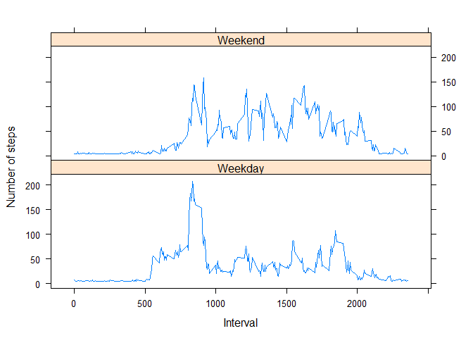

# Reproducible Research: Peer Assessment 1

## Loading and preprocessing the data
####Libraries required for the analysis

```r
library(dplyr)
library(Hmisc)
library(ggplot2)
library(reshape2)
library(lattice)
```
###Download and load the data using read.csv function.

```r
if (!file.exists("activity.zip")) 
  {
  #File URL and name
  fileUrl <- "https://d396qusza40orc.cloudfront.net/repdata%2Fdata%2Factivity.zip"
  Name <- "activity.zip"
  
  # download the file & note the time
  download.file(fileUrl, Name)
  dateDownloaded <- date()
  unzip(zipfile = "activity.zip")
}
Data_Inp<-read.csv("activity.csv",header =T )
```
#### Convert the data into data table for easy analysis

```r
Data_Inp<-tbl_df(Data_Inp)
Data_Filt<-Data_Inp[which(!is.na(Data_Inp$steps)),]
```

## What is mean total number of steps taken per day?
### Total number of steps taken per day

```r
total_steps <- Data_Filt %>% group_by(date) %>% summarise(sum = sum(steps))
hist(x = total_steps$sum, xlab = "Total Steps", ylab = "Days", main = "Total Steps per Day")
```

\

Mean and median of the total number of steps taken per day

```r
mean(total_steps$sum)
```

```
## [1] 10766.19
```

```r
median(total_steps$sum)
```

```
## [1] 10765
```
## What is the average daily activity pattern?
### Time series plot of the 5-minute interval and the average number of steps taken, averaged across all days (y-axis)

```r
Avg_step <- aggregate(Data_Filt$steps,list(interval=Data_Filt$interval),mean)
names(Avg_step)=c("interval","steps")

plot<-ggplot(data = Avg_step, aes(x = interval, y = steps)) + geom_line() 
plot<-plot+xlab("5-minute interval")+ylab("average number of steps taken")+ggtitle("Steps Taken in 5-Minute Intervals Averaged Across All Days")
print(plot)
```

\
Maximum number of steps

```r
Avg_step[which.max(Avg_step$steps),]
```

```
##     interval    steps
## 104      835 206.1698
```

## Imputing missing values
### Total number of missing values

```r
sum(is.na(Data_Inp))
```

```
## [1] 2304
```
### Imputting missing values with Impute function
#### Here I use Mean step value to replace NA values

```r
MissingValues <- !complete.cases(Data_Inp)
Data_Complete <-Data_Inp
Data_Complete$steps <-impute(Data_Complete$steps, mean)
total_steps_New <- Data_Complete %>% group_by(date) %>% summarise(sum = sum(steps))
hist(x = total_steps$sum, xlab = "Total Steps", ylab = "Days", main = "Total Steps per Day")
```

\
Mean and median of new data

```r
mean(total_steps_New$sum)
```

```
## [1] 10766.19
```

```r
median(total_steps_New$sum)
```

```
## [1] 10766.19
```

## Are there differences in activity patterns between weekdays and weekends?
#### Yes there is difference

```r
DayCalc <- function(date) 
  {
    if(weekdays(as.Date(date)) %in% c("Saturday", "Sunday")) 
      {day <- "Weekend"} 
    else 
      {day <- "Weekday"}
  }
Data_Complete$Week <- as.factor(sapply(Data_Complete$date, DayCalc))
Data_melt <- melt(Data_Complete, measure.vars="steps")
AvgSteps <- dcast(Data_melt, Week+interval~variable, mean)
```
##### Panel plot

```r
xyplot(steps~interval|Week,data=AvgSteps,xlab="Interval",ylab="Number of steps",type="l",layout=c(1,2))
```

\
